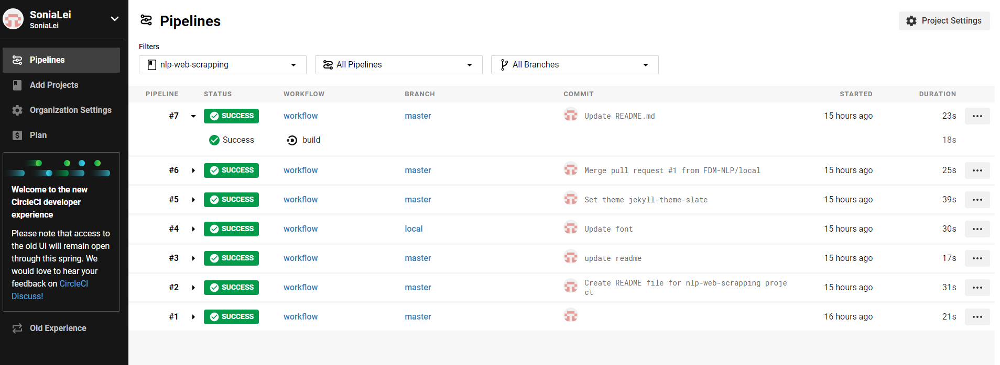
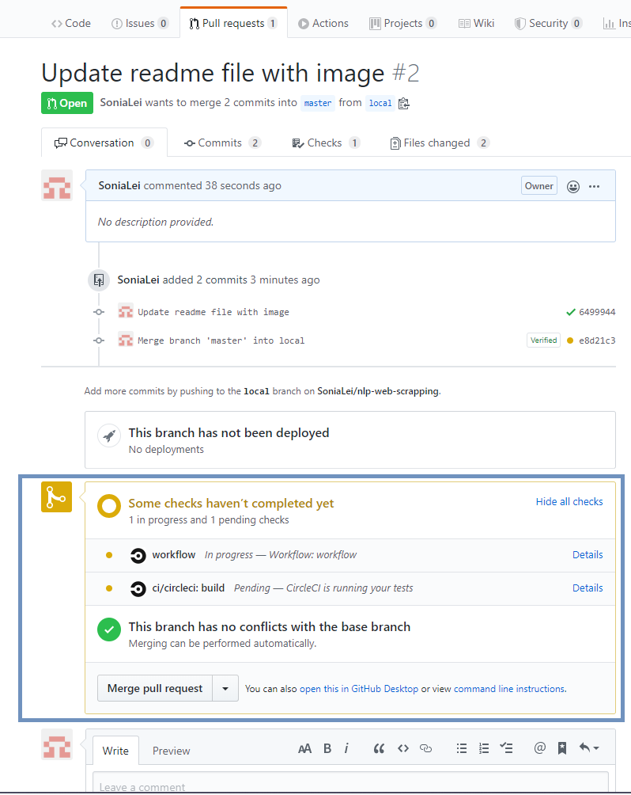
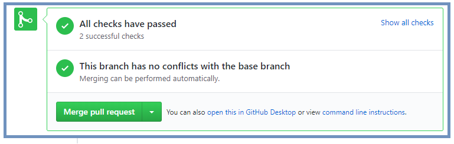
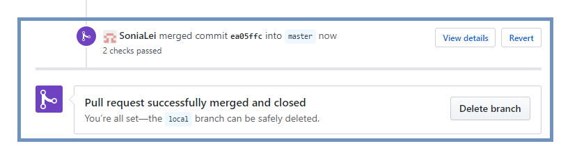

# NLP-Web-Scrapping

This is a repository for code committing and sharing for the NLP-web-scrapping project.

The project build is integrated with Circle CI tool which automatically runs your build and 
test processes whenever you commit code, and then displays the build status in your GitHub branch.

See more details on https://circleci.com/

The current CircleCI build is build under account : [Sonia Lei](cheng.lei@fdmgroup.com)

## Pull request with circle CI build

After raising a pull request in the git hub repository, the commit will then trigger a circle CI build to check for failing tests.

#### Successful build

Once the build has finished, it will show a green status for the build, allowing you to merge pull request to the target branch.

#### Merge pull request

After merging the branch, the status of this pr will then show as merged 

